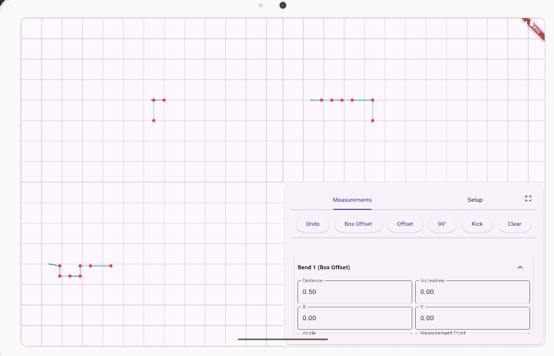

# Isometric Bend Designer

An isometric drawing tool designed for creating bend patterns for an automatic bender.

## Features
- **Isometric Drawing Interface**: Easily design bends in a 3D-like view.
- **Bend Calculation**: Automatically calculates angles and dimensions for accurate bends.
- **Export Options**: Export designs to formats suitable for the automatic bender.



## Setup
1. Clone this repository:
   ```bash
   git clone https://github.com/tjaqu787/isometric-bend-designer.git
